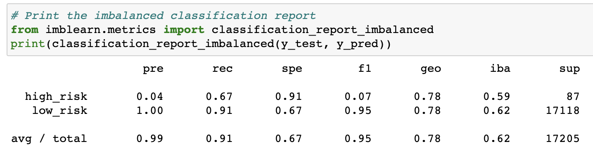
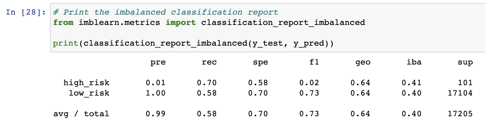
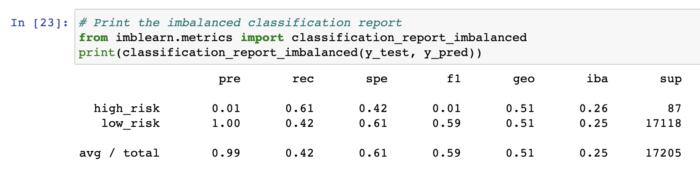
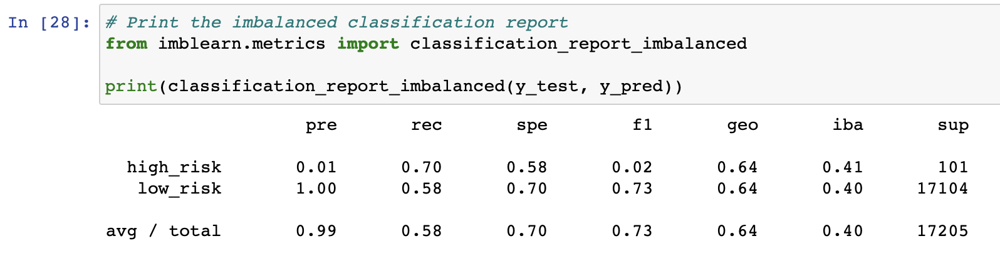
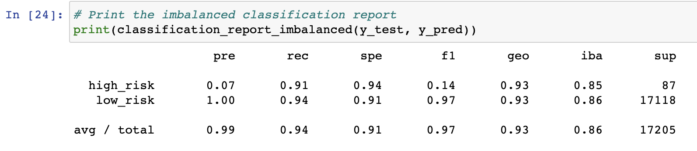

# Credit_Risk_Analysis

# Overview of the Analysis:
Credit risk is an inherently unbalanced classification problem, as good loans easily outnumber risky loans. Therefore, we have used different techniques to train and evaluate models with unbalanced classes and used imbalanced-learn and scikit-learn libraries to build and evaluate different models.

Using the credit card credit dataset from LendingClub, a peer-to-peer lending services company, we will oversample the data using the RandomOverSampler and SMOTE algorithms, and undersample the data using the ClusterCentroids algorithm. Then, we’ll use a combinatorial approach of over- and undersampling using the SMOTEENN algorithm. Next, we’ll compare two new machine learning models that reduce bias, BalancedRandomForestClassifier and EasyEnsembleClassifier, to predict credit risk. Once you’re done, we’ll evaluate the performance of these models and make a written recommendation on whether they should be used to predict credit risk.

# Results:
The balanced accuracy scores and the precision and recall scores of all six machine learning models are shown below. 

## Naive Random Oversampling

### Balanced Accuracy score = 0.6533977140416822

## SMOTE Oversampling

### Balanced Accuracy score = 0.6533977140416822

## Undersampling

## Combination (Over and Under) Sampling

### Balanced Accuracy score = 0.6400726134353378

## Balanced Random Forest Classifier

### Balanced Accuracy score = 0.7877672625306695

## Easy Ensemble AdaBoost Classifier

### Balanced Accuracy score = 0.925427358175101

# Summary:
Balanced Accuracy is the average of sensitivity and specificity with a min = 0 and max = 1. Balanced accuracy is the most accurate the closer its value is to 1. From the 6 machine learning models we worked with in this challenge, Easy Ensemble AdaBoost Classifier has the highest balanced accuracy score at 0.925427358175101

f1 score tells us what percent of positive predictions were correct. If we look at the f1 score for all 6 models, we will see that the f1 score for Easy Ensemble AdaBoost Classifier is the higest at at 0.97. The f1 score is a weighted mean of precision and recall where the most statistically relevent score is 1.0 and the least relevant score is 0.0.

We can recommend using the Easy Ensemble AdaBoost Classifier model for our data.
